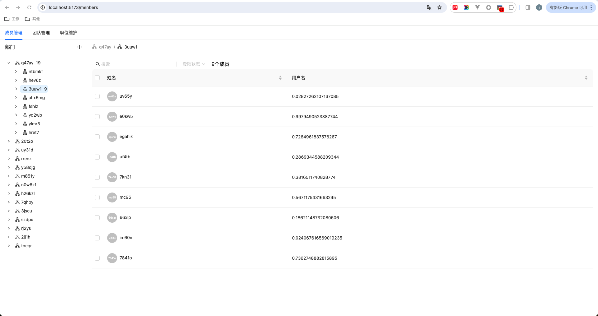

# Hixtrip FE Online

## 准备

- fork 此仓库
- 根据如下要求实现相关代码
- 完成要求
  - 提交`pull request`
  - 提供页面截图

## 需求

1. 目前已经有`src/api/user.ts` 以及 `src/api/org.ts` 两个 API
2. 需要实现如下效果界面：


> 功能要求：
- 不限 ```React``` 或者 ```Vue```
- 需要拆分 `OrgTree` 以及 `UserTable` 两个组件
  - 两个组件自己维护相关的数据。
  - 体现两个组件的互相通信。
- 组织架构根据点上级节点进行查询子级节点实现异步加载。
- 用户 ```Table ``` 数据跟据点击 ```组织架构树形节点``` 以及 ```输入搜索关键字``` 查询。
  - 需要考虑防抖节流等功能点
- 风格不限
  - 示例图仅仅是效果展示，不需要完全符合。
  - 可以使用 ```UI Framework```, 如 ```ant-design```, ```element-ui```等
  - 如果不用```UI Framework```, 可以直接用原生的```<ul> <li>```, ```<table>``` 实现，不用实现相关的CSS样式, 可以加分。

* 页面截图

## 其他简答题

### 如何将如下的`JSON`正确解析成 `Object`
```json
{
  "userId": 111323290434354540545
}
```
通过正则或字符串切割解析出JSON中userId的值字符串 '111323290434354540545',通过BigInt将字符串转换为BigInt类型在组装成Object
### 前端需要*稳定*每隔`1s`向服务端请求`API`, 请问如何实现？
在组件加载完成的钩子函数中通过setInterval设置一个定时任务，每隔一秒请求一次，在组件卸载的钩子函数中移除定时任务
### 什么情况下，你会为你的项目引入状态管理库，比如`Redux`, `Pinia`, 可以简述一下起到了什么作用么？
当某些数据需要作为全局的状态被多组件共享或状态共享的组件嵌套层级很深时会引入状态管理库，减少需共享的状态在组件件通过props逐层传递的复杂性，另外Redux提供的DevTools可以实现状态追踪、记录状态的变化
### 为什么`ESM`与`CJS`不能兼容？
* 加载逻辑不同
  在 CJS 模块中，require() 是一个同步接口，它会直接从磁盘（或网络）读取依赖模块并立即执行对应的脚本。
  ESM 标准的模块加载器则完全不同，它读取到脚本后不会直接执行，而是会先进入编译阶段进行模块解析，检查模块上调用了 import 和 export 的地方，并顺腾摸瓜把依赖模块一个个异步、并行地下载下来。在此阶段 ESM 加载器不会执行任何依赖模块代码，只会进行语法检错、确定模块的依赖关系、确定模块输入和输出的变量。最后 ESM 会进入执行阶段，按顺序执行各模块脚本。
* 不同的模式
  ESM 默认使用了严格模式（use strict），因此在 ES 模块中的 this 不再指向全局对象（而是 undefined），且变量在声明前无法使用。
* ESM 支持“顶级 await”，但 CJS 不行。
* ESM 缺乏 CJS中的 __filename 和 __dirname
